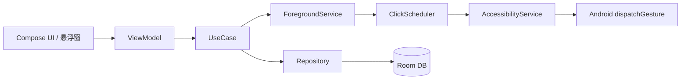

# 安卓连点器 App 开发计划

## 1. 项目概述

### 1.1 目标

开发一款可在 Android 设备上自动执行点击/滑动手势的连点器应用，支持单点、多点顺序、多点同时、定时、循环等常见场景，并提供悬浮控制面板，便于在游戏或重复操作场景中快速启停。

### 1.2 核心约束

| 约束 | 说明 |
|------|------|
| 无需 Root | 通过系统无障碍服务（AccessibilityService）实现手势注入 |
| 最低 API | Android 7.0（API 24），依赖 `dispatchGesture` |
| 目标 API | Android 14+（API 34），适配最新权限与前台服务规范 |
| 分发渠道 | 初期侧载 APK；若上架 Google Play 需额外合规审查 |

### 1.3 技术选型

| 层级 | 选型 | 理由 |
|------|------|------|
| 语言 | Kotlin | Android 官方首选 |
| UI | Jetpack Compose + Material 3 | 声明式 UI，开发效率高 |
| 架构 | MVVM + Clean Architecture（轻量） | 职责清晰，便于测试 |
| 依赖注入 | Hilt | 与 Android 生命周期集成好 |
| 本地存储 | Room + DataStore | 脚本/配置持久化 |
| 异步 | Kotlin Coroutines + Flow | 统一点击调度与 UI 状态 |

---

## 2. 功能规划

### 2.1 MVP（第一阶段，约 2 周）

**必须交付：**

- [ ] 无障碍服务授权引导页
- [ ] 悬浮窗权限申请与引导
- [ ] 单点连点：设置坐标、点击间隔、总次数（含无限）
- [ ] 悬浮控制条：开始 / 暂停 / 停止、显示当前状态
- [ ] 前台服务保活，避免后台被系统杀死
- [ ] 基础设置：点击间隔下限保护（如 ≥ 50ms）

### 2.2 增强功能（第二阶段，约 2 周）

- [ ] 多点连点（顺序模式）：按顺序依次点击多个坐标，支持每点独立间隔
- [ ] 多点连点（同时模式）：同一时刻在多个坐标注入点击，适用于双指/多指同按场景
- [ ] 点击模式切换：顺序 / 同时，编辑器内可配置并预览
- [ ] 可视化取点：半透明 overlay 上点击屏幕获取坐标，同时模式支持一次选取多个点
- [ ] 脚本保存与加载：命名、编辑、删除
- [ ] 随机间隔：在 `[min, max]` 范围内随机，降低固定节奏特征
- [ ] 滑动手势：起点 → 终点，持续时间可配置
- [ ] 深色模式与基础主题

### 2.3 进阶功能（第三阶段，可选）

- [ ] 录制回放：记录点击序列并回放
- [ ] 条件触发：检测到特定界面文字/控件后执行（Accessibility 节点匹配）
- [ ] 导入/导出脚本（JSON）
- [ ] 多配置文件快捷切换
- [ ] 统计：本次运行点击次数、累计时长

---

## 3. 系统架构

### 3.1 模块划分

```
app/
├── ui/                    # Compose 界面
│   ├── home/              # 主页、脚本列表
│   ├── editor/            # 连点配置编辑
│   ├── overlay/           # 悬浮窗 UI
│   └── settings/          # 设置与权限引导
├── service/
│   ├── ClickAccessibilityService   # 核心：手势注入
│   └── ClickForegroundService      # 前台服务 + 调度循环
├── domain/
│   ├── model/             # ClickScript, ClickPoint, Gesture
│   ├── usecase/           # StartClicking, SaveScript 等
│   └── repository/        # 接口定义
├── data/
│   ├── local/             # Room DAO、Entity
│   └── repository/        # 实现类
└── di/                    # Hilt 模块
```

### 3.2 核心数据流



### 3.3 点击执行原理

1. 用户在编辑器中配置坐标、点击模式（顺序/同时）与间隔，或通过 overlay 取点。
2. `ClickForegroundService` 以前台服务形式运行，持有 `ClickScheduler` 协程循环。
3. 每次 tick 调用 `AccessibilityService.dispatchGesture()` 注入 `GestureDescription`。
4. 悬浮窗通过 `LocalBroadcast` / `Bound Service` / SharedFlow 与 Service 同步状态。

**单点 / 顺序多点：**

```kotlin
// 单点：一条 Stroke
val path = Path().apply { moveTo(x, y) }
val stroke = GestureDescription.StrokeDescription(path, 0, durationMs)
val gesture = GestureDescription.Builder().addStroke(stroke).build()
service.dispatchGesture(gesture, callback, handler)
```

**多点同时点击：**

同一 `GestureDescription` 内添加多条 `StrokeDescription`，**共用相同 `startTime`（通常为 0）**，系统会在同一帧窗口内并行注入，等效多指同时按下：

```kotlin
// 多点同时：多条 Stroke，startTime 均为 0
val builder = GestureDescription.Builder()
points.forEach { (x, y) ->
    val path = Path().apply { moveTo(x, y) }
    builder.addStroke(GestureDescription.StrokeDescription(path, 0, durationMs))
}
service.dispatchGesture(builder.build(), callback, handler)
```

**调度策略：**

| 模式 | 每轮行为 | 间隔作用对象 |
|------|----------|--------------|
| 顺序 | 逐点 dispatch，每点可带 `delayAfterMs` | 相邻两次 dispatch 之间 |
| 同时 | 单轮一次 dispatch，内含全部坐标 | 相邻两轮同时点击之间 |

**限制说明：** 单次 `GestureDescription` 最多支持 10 条 Stroke（系统常量 `GestureDescription.getMaxStrokeCount()`）；同时模式需在 UI 中限制点数并在超限时提示用户。

---

## 4. 权限与合规

### 4.1 必需权限

| 权限 | 用途 |
|------|------|
| `BIND_ACCESSIBILITY_SERVICE` | 注入点击/滑动手势 |
| `SYSTEM_ALERT_WINDOW` | 悬浮控制面板、取点 overlay |
| `FOREGROUND_SERVICE` + `FOREGROUND_SERVICE_SPECIAL_USE` | 后台持续连点（Android 14+ 需声明 special use 类型并说明用途） |
| `POST_NOTIFICATIONS` | 前台服务通知（Android 13+） |
| `WAKE_LOCK`（可选） | 屏幕常亮场景 |

### 4.2 无障碍服务配置要点

- 在 `accessibility_service_config.xml` 中声明 `canPerformGestures="true"`。
- 服务描述清晰说明用途，提高用户信任度。
- 不请求不必要的 `flagRetrieveInteractiveWindows` 等敏感能力，除非做条件触发。

### 4.3 合规与风险提示

- 应用内明确声明：仅供辅助操作/自动化测试，禁止用于作弊或违反第三方服务条款。
- Google Play 对无障碍滥用审核严格；侧载分发相对灵活，但仍需在隐私政策中说明数据处理方式（本应用可不采集用户数据，仅本地存储）。

---

## 5. UI/UX 设计要点

### 5.1 主要页面

1. **首页**：脚本列表 +「新建脚本」+ 权限状态卡片（无障碍 / 悬浮窗 / 通知）
2. **编辑器**：坐标列表、点击模式（顺序/同时）、间隔、次数、预览示意图；同时模式用同色标记表示「同批点击」
3. **取点模式**：全屏半透明层，点击记录坐标；顺序模式显示序号，同时模式支持多选后「确认本批」
4. **悬浮控制条**：可拖动的小条，含 ▶ ⏸ ⏹ 与简要计数
5. **设置**：默认间隔、随机间隔开关、关于与免责声明

### 5.2 交互原则

- 权限未就绪时，禁用「开始」并引导跳转系统设置。
- 连点运行中，编辑器只读，防止配置与运行状态不一致。
- 停止后恢复可编辑；异常中断（服务被 kill）时 Toast 提示。

---

## 6. 数据模型（草案）

```kotlin
enum class ClickMode {
    SEQUENTIAL,  // 顺序：逐点点击
    SIMULTANEOUS // 同时：每轮所有点一次 dispatch
}

@Entity(tableName = "click_scripts")
data class ClickScriptEntity(
    @PrimaryKey val id: Long = 0,
    val name: String,
    val clickMode: ClickMode,    // 顺序 / 同时
    val intervalMs: Long,
    val intervalRandom: Boolean,
    val intervalMaxMs: Long?,
    val repeatCount: Int,        // -1 表示无限
    val pointsJson: String,      // List<ClickPoint> 序列化
    val createdAt: Long,
    val updatedAt: Long
)

data class ClickPoint(
    val x: Float,
    val y: Float,
    val delayAfterMs: Long = 0   // 仅顺序模式生效：该点点击后额外等待
)
```

---

## 7. 开发里程碑

| 阶段 | 周期 | 交付物 | 验收标准 |
|------|------|--------|----------|
| **P0 项目初始化** | 2 天 | Gradle 工程、Hilt、Compose 骨架、主题 | 可编译运行空白主页 |
| **P1 无障碍 + 单点** | 4 天 | AccessibilityService、单点连点、前台服务 | 指定坐标可稳定连点 100 次 |
| **P2 悬浮窗** | 3 天 | Overlay 控制条、权限引导 | 任意界面可启停连点 |
| **P3 编辑器 + 存储** | 4 天 | 脚本 CRUD、Room、取点 overlay | 脚本可保存并重跑 |
| **P4 多点 + 随机间隔** | 4 天 | 顺序/同时多点、随机间隔 | 2–5 点顺序与同时点击均正常，同时模式间隔稳定 |
| **P5 测试与 polish** | 3 天 | 单元测试、UI 测试、崩溃修复、适配 | 主流机型 API 24–34 无阻塞 bug |
| **P6 进阶（可选）** | 按需 | 录制、导入导出、条件触发 | 按产品优先级排期 |

**合计 MVP（P0–P3）：约 13 个工作日。**

---

## 8. 测试策略

### 8.1 单元测试

- `ClickScheduler`：顺序/同时两种调度路径、间隔计算、随机间隔边界、次数递减逻辑
- Repository / UseCase：脚本 CRUD
- 坐标校验：负值、超出屏幕的处理

### 8.2 仪器测试（Instrumented）

- AccessibilityService 连接状态 mock
- Room 数据库迁移
- Compose UI：权限引导页、编辑器表单

### 8.3 手工测试矩阵

| 场景 | 设备/API | 预期 |
|------|----------|------|
| 单点连点 10 分钟 | 小米 / 华为 / 原生 Android | 不崩溃、间隔稳定 |
| 2/3/5 点同时连点 | 各厂商 | 同轮多点均触发，无漏点 |
| 切后台再回前台 | API 33+ | 前台服务通知存在，连点继续 |
| 锁屏 | 各厂商 | 记录行为差异，文档说明 |
| 低电量模式 | - | 提示可能被系统限制 |

---

## 9. 风险与应对

| 风险 | 影响 | 应对 |
|------|------|------|
| 厂商 ROM 杀后台 | 连点中断 | 前台服务 + 用户白名单引导 |
| `dispatchGesture` 失败 | 点击无效 | Callback 重试 + 失败计数告警 |
| 同时模式部分机型多指识别差 | 同批点击被当作单点 | 文档说明兼容性；限制最大 5 点并建议短 duration（50–100ms） |
| 超过 10 点同时点击 | 系统拒绝注入 | UI 限制 + 校验 `getMaxStrokeCount()` |
| 屏幕旋转坐标漂移 | 点击错位 | 存储相对坐标（百分比）或锁定方向 |
| 无障碍被系统回收 | 服务断开 | 监听 `onUnbind` 通知用户重新授权 |
| Play 上架被拒 | 无法官方分发 | 侧载 + 明确隐私与用途说明 |

---

## 10. 项目初始化清单

开发启动前按序完成：

1. 使用 Android Studio 创建 Empty Compose Activity 项目
2. 配置 `minSdk 24`、`targetSdk 34`、Kotlin 1.9+、Compose BOM
3. 引入依赖：Hilt、Room、DataStore、Navigation Compose
4. 创建包结构与上述模块目录
5. 注册 `ClickAccessibilityService` 与 `ClickForegroundService`
6. 编写 `AndroidManifest.xml` 权限与服务声明
7. 搭建 Git 仓库与 `.gitignore`（排除 `local.properties`、`.idea` 等）

---

## 11. 后续迭代方向

- 支持 Android 11+ `AccessibilityService.takeScreenshot` 做图像识别点击（OCR/OpenCV，复杂度高）
- Widget 快捷启动最近脚本
- 平板分栏布局
- 多语言（中/英）

---

## 12. 总结

本计划以 **无障碍服务 + 前台服务 + 悬浮窗** 为技术主线，分三阶段交付：MVP 单点连点 → 脚本与多点（含顺序/同时） → 可选进阶能力。优先保证权限引导清晰、点击稳定、后台存活，再扩展录制与条件触发等高级功能。

下一步建议：按 **第 10 节** 初始化 Android 工程，并实现 **P1 无障碍单点连点** 作为第一个可演示版本。
